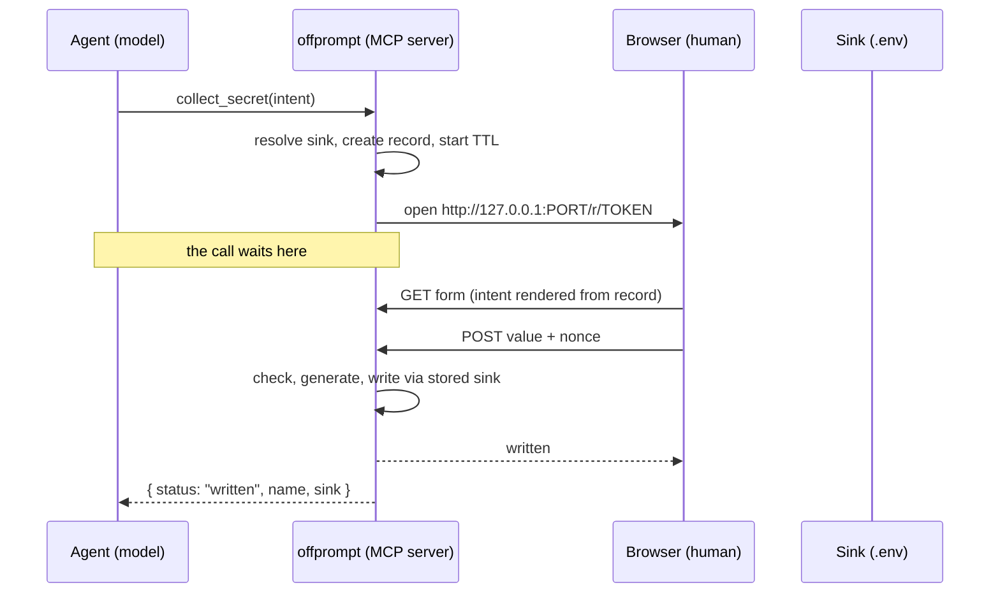
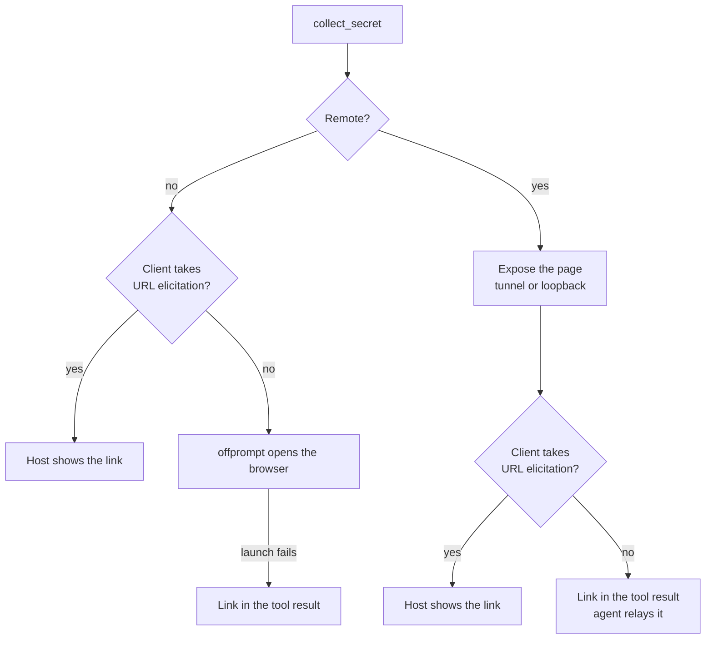

# offprompt

A secret handed over off the prompt: typed by the human, read by the project, never seen by
the model. offprompt is an MCP plugin that lets a coding agent ask a human for a secret and
have it land where the project needs it, while the transcript, the model context and the provider logs only ever
see the secret's name.

## Scope for v1

- A plugin with one MCP server. Claude Code, Codex and Cursor load it as a plugin; other
  agents declare the server in their MCP config. It acts only when the agent calls it, so
  any MCP client can load it.
- Local machine: the agent, the plugin and the human's browser share a host.
- Sinks: `dotenv` and `file`. The `exec` sink follows in step 2 of the roadmap.
- State lives in the plugin process for the duration of a request. The project tree and
  the user's home directory stay untouched.

## Flow



## Tool surface

### `collect_secret`

The agent states its intent once, for every key it needs. Everything the human later sees
is rendered from the record this call creates.

```json
{
  "secrets": [
    { "name": "STRIPE_SECRET_KEY", "provider": "stripe" },
    { "name": "DATABASE_URL", "format": "postgres_url" },
    { "name": "AUTH_SECRET", "generate": {} },
    { "name": "MAX_RETRIES", "format": "integer", "secret": false }
  ],
  "reason": "Checkout signs its requests with Stripe, and the app needs a database and a session secret",
  "sink": { "kind": "dotenv", "path": ".env" }
}
```

Each entry says how its value comes to be, in one of four ways:

| Way | Asked as | On the page |
| --- | --- | --- |
| Generated | `generate: { bytes, encoding }`, 32 bytes of base64url unless set | A field the page fills from random bytes as it opens, with Regenerate; the human may paste one they already use |
| A provider's key | `provider: "stripe"`, or `"stripe/webhook_secret"` when the name does not say which of its keys | The provider's logo, a link to where the key is made, and its checks |
| A known kind of value | `format: "postgres_url"` | What the value is, links to providers where one can be created, and its checks |
| Anything else | none of the three | Plain text. A name that one provider's key conventionally goes by is taken as that key |

`secret: false` shows a value in the clear, for one that is not secret. A provider says
the same of its own public keys, such as Stripe's publishable key.

| Field     | Rule                                                                          |
| --------- | ----------------------------------------------------------------------------- |
| `secrets` | One to twelve entries. `name` is `[A-Z][A-Z0-9_]*`; at most one of `generate`, `provider` and `format`, each an enum drawn from the registry; `secret` and `caption` optional |
| `reason`  | Markdown up to 2000 characters, labelled as the agent's claim. Rendered to a short list of tags with no attributes; links show their address as text and are not clickable |
| `sink`    | Tagged union, see Sinks. A `file` sink takes exactly one secret                |
| `sandbox` | Optional. `true` when the agent's environment tells it that it runs in a cloud sandbox, a container or a remote VM. Counts only where offprompt cannot tell; see Presenting the URL |

A batch is one page, one wait and one atomic write, rather than a request per key.

A generated value is made on the page, from the browser's random bytes, as the page opens.
It is masked like any other value; the human can show it, make another, or paste one they
already use, which is checked to be as long as one offprompt would make and in the same
encoding. A field that comes back empty, as it does with the page script off, is made on
the server at write time. The agent never sees it either way. A key the sink already holds
is kept as it is, because a new signing or encryption secret signs everyone out or leaves
stored data unreadable. A request of generated keys alone opens no page: offprompt makes
and writes them and returns at once. It refuses a git-tracked destination there, since only
the human can allow that write, on the page.

The call waits for the human. It returns once the value has been written or the record
has expired, so there is one tool call per secret and no turn is spent polling:

```json
{ "request_id": "9f3c1e7a", "status": "written", "names": ["RESEND_API_KEY"], "sink": { "kind": "dotenv", "path": ".env" } }
```

A write also yields a fingerprint: four emoji from an HMAC of the names and values, under a
key the page makes for that one submission. The page takes it from what the human typed
before anything leaves the browser, and sends the key with the values, inside the seal when
they are sealed. The server takes the fingerprint again from what the file holds once the
write lands, drops the key, and returns the four as `emoji`, with a note that opens by asking
the agent to say them to the human at once, before its next tool call. Asked for at the end
of the reply instead, they came after the rest of a long task, when the page was long
closed, or not at all: that happened in two Conductor sessions, 18 and 37 tool calls after
the write. The structured result opens with `tell_user`, "Fingerprint 🍋 🥝 🌮 🧀": Claude Code
hands the model, and draws under the call, the structured result alone, so the line to say is
the first thing read there and the first thing in the tool's row. Hosts that show the result's
text instead, such as Codex and Pi, get a line ahead of the JSON, "Wrote 1 value to .env ·
fingerprint 🍋 🥝 🌮 🧀". The note asks for the four after every write, one that comes straight
after another included: in a Conductor session on 2026-10-01 an agent said the first of two
back-to-back fingerprints and, taking the two writes for one step, not the second. The same four on the page
and in the agent's reply mean the file holds exactly what was typed, and that the write the
agent reports is this one. Should the
two differ, the page shows its own four and says the file holds something else. No page the
server serves carries the key, and nothing keeps it, so the four in the transcript let no
one test guesses at a value, however short it is. A page without its script sends no key;
the server makes one, and the four it shows are its own. A generated key made on the
server, because its field came back empty, is not in the fingerprint; the page never had it.

A file that exists but cannot be read stops the write, rather than being taken for empty:
upserting into nothing would drop every other key in it.

A write is claimed before it starts, so a page submitted twice writes once, and the agent
hears nothing until the write lands. A write the file system refuses gives the claim back:
nothing was written, the page keeps every value and shows the error, and **Try again**
writes them once the file is fixed. A page without its script cannot keep values it never
echoes, and asks for them again. An answer that is not one of offprompt's own pages — a
tunnel's error, or none within thirty seconds — leaves the values in place and has the page
ask the status endpoint what became of them; once this page has posted, a request found
written is taken for its own write. A request cancelled while its write is under way is left
to the write, and closes only if the write fails; a write that hangs holds the request open
for a minute at most. The page also says a file cannot be written before anyone types: its
folder must take new files, since the write goes through a temporary file there, and a
`.env` must be readable.

Generated keys the sink already held are listed under `kept`, and `file_keys` names every key
the file holds after the write, so the agent has no reason to open it. The note says so
outright: reading the file puts the values into the transcript, and nothing needs checking.

The note also tells the agent to show a link in its reply, on its own line, whenever the
result carries one. A link that appears only in the agent's reasoning is a request the
human never receives; that happened in a Conductor cloud session on 2026-09-21. A link
shown once, partway through a turn, can go missing as well. In a Conductor cloud session
on 2026-10-06 the agent showed it, then called `await_secret` between pieces of other work
until the request expired, and its later messages said it was waiting with no link in them.
Conductor folds a turn's earlier messages away once the turn ends, so the human never saw
the link. So while a request whose link the agent passes on is open, every `await_secret`
hands the link back, and the notes ask for it in whatever the agent writes to the human,
its last message included, with no other work between waits. The agent does not end its
turn to wait either: the page lives in the server's process, and a host may stop that
between turns. Conductor kept the agent's process through a nine-minute pause between
turns, and had replaced it after a longer one.

Claude Code's MCP tool timeout defaults to about 28 hours and its stdio idle window to
30 minutes, so the 300 second TTL bounds the wait long before either does. The manifest
declares the per-server timeout anyway, so a lower `MCP_TOOL_TIMEOUT` cannot cut it short.

Two cases do not wait, and `await_secret` does the waiting for both. One is the last rung
of the local ladder below, where the model has to relay the URL itself: blocking there
would hold back the message that gets the human to the page. The other is every request
made from a sandbox, which lives longer than any one call. Both return `awaiting`, with
the URL.

### `await_secret`

Long-polls one request for up to 60 seconds. Returns `written`, `awaiting` or `expired`.
Needed only after a `collect_secret` that came back `awaiting`, or to re-attach to a
request whose blocking call the human interrupted. While a request whose link the agent
passes on is `awaiting`, the result carries its `url` again; once that request closes
unwritten, the note says the link no longer opens and that `collect_secret` makes a new
one.

### `cancel_secret`

Expires a request. Any value already typed on the page is discarded.

## Request record

- Created by `collect_secret`, held in process memory, keyed by request id.
- Fields: the requested secrets, reason, resolved sink, token, page nonce, expiry, whether
  it was made from a sandbox and, while such a request is open, the private half of its
  key pair, and the link the agent passes on, where no page opened by itself.
- TTL is 300 seconds, and 30 minutes for a request made from a sandbox, where the human may
  not be watching when the link appears. One successful write closes the record. A value that fails
  validation leaves it open, however many times: the human is trusted.
- The POST handler writes through the sink stored in the record. The page submits the
  value and the nonce and nothing else is read from it.

## Presenting the URL

offprompt decides whether it runs on the human's machine or somewhere their browser is not
from the environment, read once when the server starts; only the agent's `sandbox` is read per
request. It runs remotely when the environment says so:

| Signal | Environment |
| --- | --- |
| `CLAUDE_CODE_REMOTE=true` | Claude Code on the web ([docs](https://code.claude.com/docs/en/cloud-environments)) |
| `SSH_CONNECTION` set | SSH, VS Code Remote-SSH |
| `CODESPACES=true` | GitHub Codespaces |
| Linux with neither `DISPLAY` nor `WAYLAND_DISPLAY` | Headless containers and VMs |

On macOS or Windows with none of these, it is the human's own machine: the sandboxes agents
run in are Linux. Only on Linux with a display can offprompt not tell, and there the agent's
`sandbox: true` decides, since Cursor's cloud VMs have a desktop and a browser the agent
drives, which the headless check alone would miss.

These signals reach offprompt only where the host passes them on. Codex gives an MCP server a
short list of its own variables, without `DISPLAY`, so a Linux desktop would look headless.
offprompt's Codex config and the plugin's Codex manifest name the variables to pass on, and
the host tests run Codex with a display on Linux and with `SSH_CONNECTION` set, to see them
arrive.

The agent is asked for `sandbox: true` only when its environment tells it where it runs,
because it cannot see where the human's screen is. On a Mac, one model set it for a run in a
temporary folder that nobody watched, a fair guess from what it could see, and offprompt
then handed out a tunnel link where it could have opened the page. The environment's answer
takes precedence wherever it has one.



### On the human's machine

The model never carries the URL. The plugin picks the first channel that works:

1. URL-mode elicitation, when the client advertises `elicitation.url`
   ([spec](https://modelcontextprotocol.io/specification/2025-11-25/client/elicitation)).
   The host shows the origin in its own dialog. Only an `accept` within a moment counts. A
   `decline`, a `cancel`, an error or no answer goes on to the next channel: `codex exec`, and
   the Codex SDK built on it, advertise URL-mode elicitation and cancel every dialog, since
   nobody is there to see it, and Claude's Agent SDK under Conductor advertised it and never
   showed the dialog or answered, which a dialog left open had been taken for being seen
   until 2026-10-05.
2. The plugin opens the browser itself with `open`, `xdg-open`, or on Windows
   `rundll32 url.dll,FileProtocolHandler`. This is the v1 default.
   Claude Code currently rejects URL-mode elicitation
   ([#69555](https://github.com/anthropics/claude-code/issues/69555),
   [#88075](https://github.com/anthropics/claude-code/issues/88075)).
3. The URL is returned in the tool result, only when the browser launch fails. The result
   says so, and the transcript exposure is accepted.

The human learns one rule: offprompt opens itself. An agent pasting a link is the case to
distrust. That rule holds on the human's machine only.

### From a sandbox

offprompt never runs the platform opener here: a browser it opened would be on a screen the
agent can see and the human cannot. It exposes its own page server, and the link always
goes into the tool result for the agent to show, and to the host's dialog as well where the
host takes one. The page is sealed to the key after the `#`, so the link is no secret, and a
dialog is not always one the human sees: under Conductor's cloud workspaces the Agent SDK
took the dialog and never showed it, and the agent had no link to pass on.

**Quick tunnel.** One `cloudflared` quick tunnel (try.cloudflare.com) per MCP server
process, started on the first remote request and reused by every later one.

- `cloudflared tunnel --no-autoupdate --url http://127.0.0.1:<port>`, spawned without a
  shell. Its stdout and stderr are piped and read, never inherited: the MCP server's own
  stdout is the protocol channel.
- The binary is `cloudflared` on `PATH` when present. Otherwise offprompt downloads a pinned
  release for the platform from Cloudflare's GitHub releases, keeps it only when its
  SHA-256 is the one pinned in the source, and caches it in the plugin's data directory
  (`${CLAUDE_PLUGIN_DATA}`, passed in through `.mcp.json`), or in `$XDG_CACHE_HOME/offprompt`,
  `~/.cache/offprompt` without it, under a host that gives none. Linux and macOS, x64 and
  arm64, are pinned; the download has 60 seconds of its own.
- The address is the first `https://<words>.trycloudflare.com` on its stderr. The link is
  handed out only once a GET through the tunnel reaches offprompt's own server, and the start
  gives up 20 seconds after `cloudflared` runs.
- A quick tunnel's DNS record appears a few seconds after its address is announced, and a
  resolver asked before that caches the "no such name" and repeats it long after the record
  exists. So the readiness check asks the zone's own nameservers, which cache nothing, and
  pins its GET to the address they give. The system resolver is left alone, and so is the
  human's, which first hears the name when the record is already there.
- If the child exits, the next remote request starts a new tunnel with a new address.
  Links handed out earlier stop working. Shutdown sends the child SIGTERM, then SIGKILL
  after 2 seconds, from the same `close` path that stops the loopback server.
- `OFFPROMPT_TUNNEL=off` skips the tunnel, for an environment whose port forwarding already
  carries the page.

Quick tunnels are "intended for testing and development only", with no uptime guarantee, a
200 in-flight request limit and no server-sent events
([Cloudflare docs](https://developers.cloudflare.com/cloudflare-one/networks/connectors/cloudflare-tunnel/do-more-with-tunnels/trycloudflare/)).
offprompt needs none of what they leave out. `cloudflared` dials Cloudflare directly on port
7844 and ignores `HTTP_PROXY`
([#350](https://github.com/cloudflare/cloudflared/issues/350)), so a sandbox that sends all
traffic through an HTTP proxy, as Claude Code on the web does, cannot open one.

**Loopback fallback.** When no tunnel comes up, the link is
`http://127.0.0.1:<port>/r/<token>#k=<key>`, for the vendor's port forwarding to carry. It
works as it is where the vendor forwards the port under the same number, and with the port
edited where the vendor picks another. Nowhere else: the tool result says so plainly, and
offprompt stops there.

### Sealed values

Every remote request gets its own ECDH P-256 key pair. The public half travels in the link
after the `#`, which a browser never sends to a server, so no tunnel or proxy sees it. The
host does, since the link travels in its dialog or the tool result, and from the result it
reaches the transcript and the provider's logs: harmless for a public key. The private half
is non-extractable and lives on the request record. It is dropped from the record when the
request leaves `awaiting`: on the write or the cancel, and on expiry at the next read of the
record, which every submission makes first. Dropping releases it for garbage collection and
does not wipe it. From then on nothing in offprompt can open a sealed value captured
anywhere.

When the human writes, the page:

1. builds the plaintext `{"values":{"value0":"…"},"allowTracked":false,"fingerprint":"…"}`,
   the fields a plain POST carries minus the nonce;
2. makes an ephemeral P-256 key pair of its own;
3. derives an AES-256-GCM key: ECDH with the sandbox's public key, then HKDF-SHA-256 with
   salt = the request token's 16 bytes and info = `offprompt/v1/seal`;
4. encrypts under a random 12-byte IV with additional data
   `offprompt/v1|<token>|<page nonce>`, which ties the ciphertext to this request: the nonce
   is the request's own, the same on every load of its page;
5. posts two fields, `nonce` and `sealed`, where `sealed` is
   `v1.<page public key>.<iv>.<ciphertext>`, each part base64url.

The nonce stays in the clear because the server checks it before decrypting. The opened
JSON becomes the same map a plain POST produces, so validation and the write are the same
code for both.

Node and every browser ship ECDH P-256, HKDF and AES-GCM with no dependency, and a P-256
key fits in a link, where an RSA-OAEP key would add about 400 characters. WebCrypto needs a
secure context, and both remote addresses are one: the tunnel is HTTPS, and browsers treat
`127.0.0.1` and `localhost` as secure.

## Starting on demand

A host starts its MCP servers when a session opens and keeps them until it closes, and most
sessions never ask for a value. On Node, offprompt held about 80 MB the whole time: 40 for
Node, 27 for the MCP SDK and Zod, 9 for offprompt itself. Another runtime does not change that
much: Bun runs the bundle as it is at 58 MB with `--smol`, and the small runtimes, LLRT among
them, have no HTTP server for the page.

So the plugin's `launcher/offprompt-mcp` is a launcher in bash, about 3 MB while idle. It answers
what a host asks as a session opens from what the server said when it was built, saved in
`dist/handshake/`: `initialize`, at the protocol version the host asks for where the server
speaks it, else its newest; `tools/list`; `ping`; and "method not found" for the requests the
server does not know, Claude Code's `server/discover` probe ahead of `initialize` among them.
The first other request, a tool call above all, starts the server: the launcher replays the
opening to it, waits for its answer and drops it, and from then on passes everything through.
A message it is not sure of, one with a second `id` or `method` key, goes to the server too.

The server tells the launcher when it may stop, through the file named in
`OFFPROMPT_STATE_FILE`: once no tool call runs, no request is open, and none has come for five
minutes. The launcher closes its input, as a host ending a session does, and the next call
starts it again, some 75 ms later. No request is open across a stop, so nothing a page or
`await_secret` needs is lost. `OFFPROMPT_IDLE_SECONDS` shortens the wait for tests.

The server starts at once, as before, on Windows and in project installs. On Windows no agent
runs the sh launcher by itself: Codex refuses it as "not a valid Win32 application", and Claude
Code and Pi need an `sh` a default Git for Windows install keeps off the PATH. So `init -g` on
Windows has the copy's manifests start `node dist/mcp.mjs`, as found in the host tests on
2026-10-05. Project installs run `node tools/offprompt/mcp.mjs`, so the command works on every
teammate's machine. Built 2026-10-04, and checked against Claude Code 2.1.289, which opens with
`server/discover`.

## Loopback server

- Binds `127.0.0.1` on a random free port for the lifetime of the MCP server.
- Request path carries a 128-bit random token.
- Every request is checked for a `Host` header of `127.0.0.1` or `localhost`, on any port,
  since port forwarding may carry the page to the human under another number, or of the
  tunnel's hostname exactly, while a tunnel is up. Anything else is answered 421, which
  closes DNS rebinding: a rebinding page's requests carry its own domain as `Host`.
- A request the browser marks as from another site is refused with 403: a `Sec-Fetch-Site`
  of `cross-site` or `same-site`, so a page on another port of the same host is refused too.
  `Origin` is only a fallback, because the page's own `Referrer-Policy: no-referrer` makes a
  browser send `Origin: null` on its own form submission; it accepts the loopback on any
  port, the tunnel's origin, and no `Origin` or `null`. The status path checks only `Host`.
  Every path still needs the request's 128-bit token. The served page embeds a nonce the
  POST must echo.
- A remote request takes its values sealed. A POST to one without `sealed`, or with value
  fields beside it, is refused with 400: without the page script, values would cross the
  tunnel in the clear. A sealed value that does not open is answered 403 with the
  out-of-date page, exactly like a bad nonce, and never says which part failed. The remote
  page keeps the write button off until its script has read a valid key from the link, and
  says so when the link has none or the browser has no WebCrypto.
- A path without a token offprompt issued is a 404, so a scanner that finds the tunnel's
  address gets nothing else. A closed request's page answers 410 for an hour after it expires.
- The page ships with `Content-Security-Policy: default-src 'none'; script-src 'nonce-…';
  connect-src 'self'; style-src 'nonce-…'; font-src data:; form-action 'self';
  base-uri 'none'; frame-ancestors 'none'`. Its one script and its styles
  are inline under a nonce minted per response, its two typefaces are inside the stylesheet,
  it loads nothing from the network, and the only place the script can send a request is
  the loopback server that served it. Colours that vary by provider are SVG fills, since
  the policy refuses inline styles.
- Every value field is a textarea, single-line values included, and every secret
  single-line one is masked with `-webkit-text-security`; a multi-line value and one marked
  not secret show in the clear. Safari's AutoFill takes an input for a password field when it is typed as a
  password or masked that way, and once something is typed into one it offers to save the
  value when the form submits or the field leaves the page. It never takes a textarea for
  one. A single-line field drops line breaks as a text input would, in the page script and
  again on the server, so a key copied with its trailing newline is stored without it.
- The page script posts the values itself, so a rejected value redraws only its rule lines
  and everything typed stays in place. With script off the form submits natively.
- The page polls `/r/<token>/status` every ten seconds and keeps the top bar true:
  connected and how long the request has left, reconnecting, expired, or answered
  elsewhere. A server that stops answering, or a request that closes, also gets a banner in
  the import card's place, and the button waits: nothing is written until the server is
  back, and never once the request is closed. Answered elsewhere appears the moment anyone
  else answers the bearer link, before the human types. The endpoint answers for a closed
  request too, pins `Host` like every other path, and is a 404 for an unknown token.

## Form

The page is light, set in Geist and JetBrains Mono, with Lucide icons, all carried inside
the page. A bar across the top holds the mark, the connection line and the address the
page was served from. Below it, in this order:

1. Who is asking — "Claude Code is asking for five values." — with the host's badge and the
   project it works in, then the agent's reason, rendered from Markdown. Every character
   is escaped before any of it is read as Markdown, and the output is a short list of tags
   with no attributes. A link shows its address as text instead of becoming clickable,
   because this is the page a person types secrets into. The only clickable links on it
   come from the registry.
2. Where it writes: the file, its project, the full path on hover, and a few words on its
   state — a new file, one that exists and how many of the keys it already holds, not
   gitignored, or tracked by git. A remote request adds that the values are encrypted in
   the browser.
3. A card saying a block can be pasted anywhere on the page, with **Choose file** for a
   `.env`.
4. One field per key, in a card headed by the count and a switch that shows or hides every
   masked value at once. A field carries its name, the provider's logo tile, and on the
   right the address where the key is made, or what kind of value it is. The caption the
   agent gave it sits under the name. Under the field come its rules, then a line for a
   value nothing checks, providers that can create one for someone who has none yet, and
   a notice when the file already holds the key and writing replaces it. Formats that
   allow multi-line values, such as `pem` and `json`, get a taller field and a file picker.
   A generated key gets a field of its own, filled as the page opens, with Regenerate, or
   Generate once it is cleared; one already set gets a row saying it is kept.
5. The override for a file git tracks, a problem that is not about one field, and the
   button that writes, then three lines on what the page does: straight into the file,
   the agent gets the names, no outbound requests.

Pasting a block of `NAME=value` lines into any field fills every field it names, the way
the Vercel dashboard does. Importing a `.env` through the picker, or dropping one anywhere
on the page, does the same: the file is read in the page and fills the fields, and the
file itself is never submitted. The page script reads the paste with the same dotenv parser the
sinks write with, so quoting, `export` prefixes and ordering survive a copy out of a
dashboard. A banner takes the import card's place and says what the fill did: how many
fields it filled, how many need a fix, and which keys it skipped because the request did not
ask for them, with **Undo** until the human types over a filled field. A paste that names
none of the requested keys lands in the focused field as an ordinary paste — so a bare key
that happens to contain `=` stays a bare key. While a file is dragged over the page, an
overlay says what dropping it will do and names the keys it will fill; a browser does not
say which file it is until it lands. A file that names none of the keys goes whole into
the multi-line field it was dropped on, such as a PEM, and a request written to a file of
its own has no `.env` card at all: a file dropped anywhere on it fills its one field.

Above the button a bar counts the values ready, and the button says what is left: "Fill 3
values to write", "Fix 1 value to write", then "Write to .env.local". While the values are
on their way the fields hold still, a key that is being replaced says so, and the button
turns. ⌘ or Ctrl with Enter writes from anywhere on the page.

The server does not depend on the script. A field submitted holding its own `NAME=value`
line, as a paste with the script off would send it, is stored as the value alone; a line
naming any other key is stored exactly as typed.

Each field lists its rules as lines underneath it. The page script checks the value as it
changes: a line turns green when the value keeps the rule and red when it breaks it, and
the write button stays off until every field is valid. While the field has focus, a value
that is only short, or only part of the way into its prefix, is not yet wrong: the line says
"14 so far" and waits. Once every rule passes, the lines fold into one — "Looks like a
Stripe webhook signing secret", or "Matched from .env.production · …" for a value a file
filled. Spaces at either end are pointed out, with **Trim**, and written as typed if left.
Each masked field has its own eye beside the one switch for all of them. The server runs the same checks on
submit and marks the broken lines under the field they belong to, which is what a page
with script off relies on. A problem that is not about one field — a git-tracked
destination without the override — shows by the button. Nothing is written unless every
key has a valid value, and the write is one atomic pass.

The heading names the program the agent runs in — "Claude Code is asking" — taken from
the `clientInfo` every MCP client sends at `initialize`. The host program sets it, not the
model, so the agent is never asked to introduce itself. Known hosts get their proper name
from `packages/offprompt/src/registry/clients.ts`, and some a logo and a colour; any other
shows the name it gave.

After a write the page says **Written.**, shows the fingerprint's four emoji with their
names and how they appear on the agent's side, and lists the file and each key in it as
added, replaced, generated or kept. It holds no value, and it says the tab can be closed.

## Registry

The registry is plain data inside the plugin: formats, and providers with the keys they
issue. The tool's `provider` and `format` enums are drawn from it, so the model can only
name an entry that exists, and adding one is one entry. A provider with one key is named
alone; one with several also lists each key as `provider/key`.

- A format is a kind of value no single provider owns: `text`, `integer`, `hex`, `base64`,
  `email`, `url`, `uuid`, `jwt`, `pem`, `json` and `postgres_url`. It carries its rules
  and, when the name does not say, a label such as "Postgres connection string".
- A provider has a name, a category, a logo, the domains its links may point at, the keys
  it issues, and the formats it can create a value of: Supabase, Neon and PlanetScale each
  create a Postgres database. Logos come from Simple Icons or lobe-icons; a brand neither
  draws, such as Slack or Twilio, whose owners had Simple Icons remove them, shows its
  initial.
- A key has a label, the env names projects conventionally give it, the page where it is
  made, a placeholder, and its rules. Rules stay loose, a prefix and a wide length range,
  because a rule that goes stale blocks a valid key. The prefix catches the most common
  human error, pasting a key from the wrong provider. Where a provider still honours keys
  with no prefix, or says its format may change, as GitLab, Netlify, Fly, DigitalOcean and
  Notion do, the prefix only lets the page recognise a key, and a key is taken on its
  length. A key whose rules no example can be made from, such as a Telegram bot token's
  digits, colon and letters, carries an example of its own.

It started with Stripe, Resend, OpenAI, Anthropic, GitHub, Vercel, Supabase and Neon, and on
2026-10-04 grew to 65 providers in eight categories, each key's checks taken from the
provider's own docs, SDK or CLI. It is laid out the way [1Password's shell-plugins](https://github.com/1Password/shell-plugins)
lays out its plugins: a schema every entry follows, a folder per provider holding its
entry, a file per key, its logo and a test, and one list of every provider. A registry test
parses each entry against the schema and checks the whole: no two keys claim the same env
name, and every offer names a format that exists. The folder imports nothing from the rest
of offprompt, which a test also checks, so once its shape settles it moves to its own MIT
repository where other tools can use it too.

Every link in the registry is https and on one of its provider's own domains, which a test
checks, and it opens in a new tab without sending this page's address. Logos are single
SVG paths, from Simple Icons (CC0) and lobe-icons (MIT), drawn inline in the text colour.

Rules are plain data — a prefix, a length range, a character set, a known format, or a
choice between two sets. The server hands each field its rules on the page, and the page
script runs them through the same checks, so what the page shows is exactly what the
server will accept. Every rule carries its own line, for example "starts with re_" or "20 to 80
characters", so a person sees each thing to fix rather than one summary. Lines are written
by hand. The page script adds to a broken line at most the value's length or the prefix it
starts with — "got 19", "got pk_live_", "got mysql://" — and only a prefix that names what
the value is, never a stretch of a secret; the server's own lines add nothing. Two quiet
rules apply everywhere and show only when they fail: a length cap, and, for a `.env`
destination, that the value can be stored there at all.

The page also knows every provider key by its prefix, so a value that fails its field and
matches another key says which: "That's the publishable key. Use the secret key from the
same page." for its sibling on the same dashboard page, "This looks like an OpenAI API
key." for another provider's.

## Sinks

| Kind       | Fields             | Behaviour                                                                                  |
| ---------- | ------------------ | ------------------------------------------------------------------------------------------ |
| `dotenv`   | `path`             | Upserts `NAME=value`, preserves every other line, atomic write, mode `0600` on Unix        |
| `file`     | `path`             | Writes the value as the whole file, atomic, mode `0600` on Unix                            |
| `exec`     | `command`, `via`   | Spawns without a shell, injects as env var or stdin, scrubs the value from captured output |
| `keychain` | `service`          | macOS Keychain via `security`                                                              |

Rules shared by `dotenv` and `file`:

- Paths resolve against the project directory and must stay inside it. The project is the
  server's working directory, as Claude Code starts it there, unless that directory lies
  outside every workspace the host names: then it is the first one. A host names them as
  MCP roots (`roots/list`), read loosely so that one root that is not a file URL does not
  cost the others, or by a convention of its own under `hosts/`: Codex in each call's
  `_meta`, Cursor in `WORKSPACE_FOLDER_PATHS`. An Agent Plugins client starts the server in
  the plugin's own folder, and Cursor starts the Claude Code plugins it loads in the home
  directory. With no workspace and a working directory that is offprompt's own folder, the
  home directory or `/`, the request is refused, and the refusal tells the agent to stop and
  tell the human, not to work around it. The host sets all of these, never the model.
- A git-tracked target is refused unless the human overrides on the form.
- A written file has mode `0600` on macOS and Linux. Windows has no file modes: the file takes
  its folder's permissions, which under the user's own folder means the user and the
  machine's administrators. Found when the tests first ran on Windows, 2026-10-04.
- An existing key is updated in place and the form says it will be replaced.
- A `.env` value is written the way `dotenv` reads it back, and the way a shell that
  sources the file reads it too: bare only when it holds nothing but letters, digits and
  `_@%+=:,./-`, otherwise single-quoted, which both take literally, or double-quoted with
  `\n` escapes for a value on several lines. A shell reads that last form differently, keeping
  `\n` as written, and so a value with a single quote and a `$` or a backtick, which only
  double quotes can carry; dotenv reads both exactly. A value is never double-quoted when it
  carries a backslash of its own, which a reader could take for an escape. One that no form
  can carry exactly — a single quote with a double quote or a backslash — is refused before
  anything is written. Bare used to mean whatever dotenv could read unquoted, until a Neon
  connection string's `&` ended the assignment for an agent that sourced the file, on
  2026-10-01.

The `exec` sink is how a value reaches a remote store: `vercel env add`, `gh secret set`
and `fly secrets set` all accept the value on stdin, so the CLI is the adapter.

## Decisions

**The agent calls offprompt; offprompt does not watch the agent.** The agent is trusted. The
problem is narrow: an agent needs a string only the human has, in a place the project
reads. Earlier versions shipped three hooks — a paste interrupt on every prompt, redaction
of `.env` values from tool output, and a guard on staging — and all three were removed.

Each one inspected traffic to guess at intent, and each misfired in use. The staging guard
refused a committed `.env.example`, because a template is deliberately not gitignored, and
then refused prose that merely mentioned staging a `.env`. The paste detector blocked
ordinary identifiers such as `score_calculation_module_v2`. Guarding an agent against
itself, or a human against their own clipboard, is a different tool.

The line offprompt does hold is at its own write: a value only goes into a git-tracked file
when the human ticks the override on the form.

**Exposing a port is the environment's job.** From a sandbox, offprompt serves its page the
way `pnpm dev` serves an app: on a local port, carried out by a quick tunnel or by the
vendor's port forwarding. It runs no relay and no service of its own. Where a sandbox lets
no port out, offprompt says so and stops.

## Threat model

Trusted with the value: the human, the browser tab offprompt opened, the plugin process,
the sink.

Kept away from the value: the model, the MCP client, the transcript on disk, provider
logs, tool arguments and results, generated code.

offprompt keeps the value out of the conversation on the way in. The value travels from the
browser to the plugin to the sink and never through the agent. What the agent does with
the file afterwards is the agent's call, because the agent is trusted.

From a sandbox there is a public link and a transport, and encryption keeps values away
from both:

| Party | Sees |
| --- | --- |
| The human's browser | The values, as on their own machine |
| The tunnel, or the vendor's port forwarding | The page, and ciphertext only |
| The model, the transcript, the MCP client | The link: its token and public key |
| Anyone who gets the link within the TTL | Enough to submit, never to read |
| offprompt in the sandbox | The values; it writes the file, then drops the key |
| The sandbox vendor | The written file, like any file in its VM |

What it protects against:

- A value passing through the conversation. The human types it into a page offprompt opened,
  so it never appears in a prompt, a tool argument or a tool result.
- A poisoned prompt redirecting the write. The sink is fixed at request time, resolved
  inside the project, and shown to the human as an absolute path.
- A lookalike URL from a poisoned prompt. On the human's machine offprompt opens the browser
  itself.
- A phishing link in the agent's reason. The page shows the agent's links as text; the
  only clickable links come from the registry, on the provider's own domains.
- A page in another tab reaching the loopback server. Host check, CORS deny, page nonce.

What it does not protect against:

- Another process running as the same user. It can read the file after the write and
  can reach the loopback server. Same-user isolation is an OS problem.
- A human typing the value somewhere else, the chat included.
- The sink itself. A `.env` on disk is readable by whatever can read files, the agent
  included. This happened in a Conductor cloud session on 2026-09-21: the agent had
  written the public half of a `.env` itself, offprompt merged the secrets in, and the agent
  opened the file with its `Read` tool "to double-check it looks complete". Every value went
  into a tool result, so into the model's context, the session transcript on disk, the
  sandbox snapshot and the vendor's stored session. The tool result and description now say
  not to open the file and list every key it holds, which is what the agent went looking
  for. Nothing short of watching the agent's file reads can enforce it, and offprompt does
  not watch the agent.

Accepted from a sandbox:

- The link is a bearer link. Whoever holds it within the 30 minutes can submit first, for
  example a `DATABASE_URL` pointing at their own database. It shows: the human's own
  submission then fails. The MCP spec asks a server collecting secrets through a URL to
  check that the person opening it started the request
  ([spec](https://modelcontextprotocol.io/specification/2025-11-25/client/elicitation));
  remote requests do not.
- The human cannot tell a real link from a fake. Anyone can create a `trycloudflare.com`
  address, so trust rests on the agent handing the link over, which the design already
  trusts.
- The tunnel serves the page. An operator who rewrote the page script could read values
  before they are sealed. Encryption stops passive exposure such as logs and inspection,
  not an active rewrite. Vendor forwarding adds no one, since the vendor already runs the
  sandbox.
- The page can be turned on other people. Anyone can run offprompt and send a stranger a
  link that looks like an honest key request, logos included. The only defence is the page
  stating plainly where values go.

## Prior art

| Project                                                              | What it is                                                           | Where offprompt differs                                                                                  |
| -------------------------------------------------------------------- | -------------------------------------------------------------------- | ------------------------------------------------------------------------------------------------------ |
| [Veil MCP](https://github.com/rosostolato/veil-mcp)                  | Same broker shape, adapters for `.env` and GCP, risk tiers           | Batch collection on one page, elicitation ladder, exec sink, zero config                               |
| [keyhole](https://github.com/maferland/keyhole)                      | CLI plus Claude Code plugin, keychain default, Stop hook nudge       | MCP tool the model can call, intent shown before entry, a registry of provider keys                    |
| [NoxKey](https://github.com/manchmod/Noxkey)                         | macOS Keychain vault with Touch ID and MCP handoff                   | Collects a secret that is not stored yet, and writes where the app reads it                            |
| [secrets-mcp-server](https://pypi.org/project/secrets-mcp-server/)   | Encrypted store, exec and write-to-file                              | Collects from the human out of band instead of a pre-filled vault                                      |
| [Prismor Cloak](https://www.prismor.dev/docs/cloak)                  | Hook-based placeholder substitution                                  | Collects the real value and writes it where the app reads it, rather than rewriting the agent's traffic |
| [Vaulted MCP](https://www.vaulted.fyi/blog/share-secrets-ai-agents-mcp) | Outbound zero-knowledge share links                               | Different direction: human to agent, local                                                             |
| 1Password Credential Broker, Cursor plugin, Agentic Autofill         | Vault-backed release to trusted requesters                           | offprompt handles the moment before a secret exists in any vault                                         |

## Roadmap

1. `collect_secret`, `await_secret`, `cancel_secret`, the `dotenv` and `file` sinks, the
   form, batch collection, generated values and a starter registry. Local, Claude Code. Dogfood and note each time
   the agent needed a value, and whether it asked offprompt for it.
2. `exec` sink: a table of known stores covering the common cases, plus custom injection
   commands for the rest. The value goes to the command on stdin, never in its arguments,
   and the form shows the human the exact command before they type. Tested on
   `vercel env add` and `gh secret set` from a real project.
3. Elicitation ladder, and a published compatibility matrix for Claude Code, Cursor,
   Codex and the VS Code extension.
4. Cloud sandboxes, devcontainers and SSH: the page exposed through a quick tunnel or the
   vendor's port forwarding, and values sealed in the browser with WebCrypto ECDH P-256 and
   AES-GCM, so whatever carries the traffic sees only ciphertext. Built; to be run once
   each in a Cursor Cloud Agent, a Conductor cloud workspace and Claude Code on the web,
   noting the variable each sets so detection does not rest on the agent's word there.

5. Status on the page and the four emoji. Built 2026-09-24; see Tool surface and Loopback
   server.
6. Who is asking. Built 2026-09-24: the heading reads "Claude Code is asking", from the
   `clientInfo` the host sends at `initialize`, which the model cannot make up. The list is
   `packages/offprompt/src/registry/clients.ts`; a host not on it shows the name it gave,
   and the server logs every host's name at connect so new ones can be added. "in
   Conductor" is added when the environment says so.
7. Stores the human already has. The page's `.env` import, a paste, **Choose file** or a drop, is the integration: `vercel env
   pull`, `doppler secrets download`, `op inject` and `infisical export` each produce a file
   on the laptop to drop on the page, with the store's credential never leaving it. The
   README carries the recipes. Browser-side fetching from a store needs CORS the stores do
   not grant, and was not pursued.
8. Several destinations in one request. A request has one sink today, so a task that needs
   `.env` values and a key in a file of its own makes two calls: two pages, two waits, two
   fingerprints. Each secret names its own sink, falling back to the request's. The page
   groups the fields under each destination, each with its path and git check, and a paste
   or a drop still fills fields across them. The write prepares every file before putting
   any in place, and restores those already replaced if one fails, so it stays all or
   nothing. One fingerprint covers every value, read back from every file. The instructions
   then ask for everything a task needs in one call, whatever file each value goes to.
   Found in the playground, 2026-09-28.
9. Bundles. Some values only work together, and a project needs all of them at once: an
   OAuth client is an ID, a secret and a redirect URI; a Supabase project is a URL, a
   publishable key and a secret key; SMTP is a host, a port, a user, a password and a sender.
   A bundle is a registry entry that lists its members, and the agent asks for one as a
   single entry, which the page shows as one card with a field for each member. Some bundles
   belong to a provider and sit with its keys, such as Supabase's project or Upstash's REST
   URL and token. Others belong to no one provider, such as an OAuth client, SMTP or
   S3-compatible storage. Each member has a role, the names code conventionally reads it
   under, whether it is secret, and its rules; one that is not secret, such as a redirect URI
   or a sender address, shows in the clear. Libraries read the same value under different
   names, `AUTH_GOOGLE_ID` for Auth.js and `GOOGLE_CLIENT_ID` for most others, so the agent
   names each member the way the project reads it and the registry's names are the default.
   A credentials file a provider hands out, such as Google's JSON for an OAuth client, fills
   the whole card when dropped on it. The 29 `.env.example` files in Stripe's MIT
   [projects-templates](https://github.com/stripe/projects-templates) show which names real
   apps read together, a start for the first bundles. Suggested 2026-09-29, after reading
   how Stripe Projects hands over a service's values together.

Not pursued: serving the page from `offprompt.dev`. The sandbox already ends up holding the
values, so a page served from there adds no party who could read them; a page served from
`offprompt.dev` adds one, and a top-level document cannot be verified by the browser. To
revisit if `trycloudflare.com` is blocked in practice.

## Open questions

- Whether `keychain` belongs in v1 for people who keep `.env` files out of the tree.
